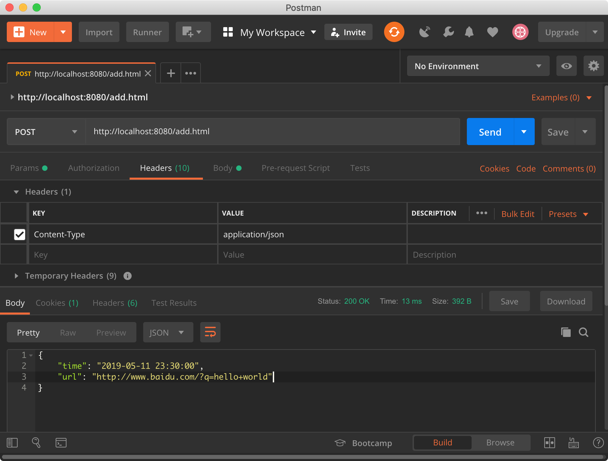
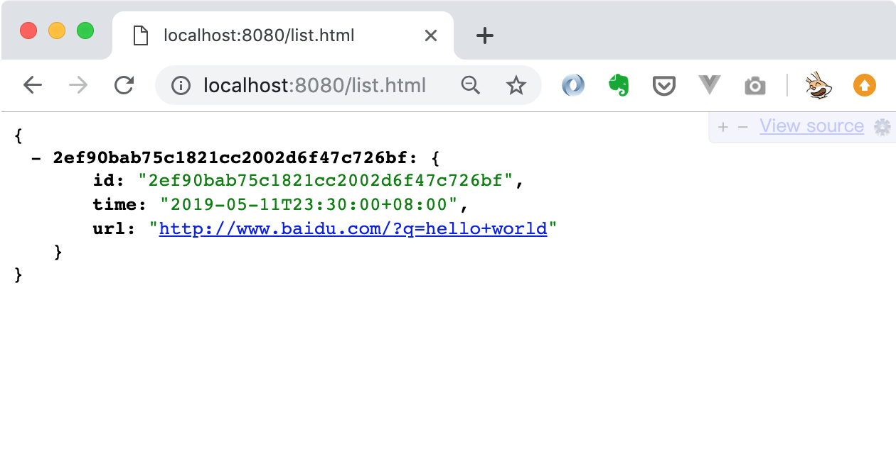

一个基于http请求的定时任务(webhook)    

使用postman添加一个webhook回调



当前任务列表



## 部署
确保在机器上安装了docker,在项目目录下执行
```
docker build -t go18 .
```

使用`docker images`查看编译好的镜像   


在项目目录下执行以下命令启动容器:
```
docker run -d --name jobs \
-p 8080:8080 \
-v $(pwd):/go/src/app \
-v $(pwd)/packages:/go/src/ go18
```
$(pwd)指项目根目录

访问[http://localhost:8080/list.html](http://localhost:8080/list.html)


## 使用说明
### 添加任务
POST [http://localhost:8080/add.html](http://localhost:8080/add.html)     
Content-Type：application/json   

```
{
    "time": "2019-05-11 20:50:10",//触发时间
    "url": "http://www.abc.com/batchid=abc123",//get请求的url
    "maxtries":"7"//最大失败次数
}
```
当到达`2019-05-11 20:50:10`时程序将使用get请求地址`http://www.abc.com/batchid=abc123`,从而触发自己的业务
当时time参数小于当前值时会立即执行,NodeJS传参的时候注意maxtries是字符串类型，而非Number类型

### 删除任务
POST [http://localhost:8080/del.html](http://localhost:8080/del.html)    
Content-Type：application/json   
```
{
	"id":"077210d739a0bcbef4f995618eaf9797"//md5(time+url+maxtries)
}
```


### 查看任务
get [http://localhost:8080/list.html](http://localhost:8080/list.html)      
response header   
Content-Type：application/json   

### 任务的持久化
每10秒钟检查一次任务列表长度，当长度发生变化时将队列持久化到文件`./jobs.queue`。
服务启动的时候将尝试读取本地的`./jobs.queue`

### get请求url触发业务
当get请求url触发业务时，返回http状态码等于`200`时认为调用成功、从队列中移除任务。非200状态则10秒后重新请求、请求失败次数+1。超过最大失败次数时从队列中移除该任务。
id值的计算为所有参数拼接后md5,所以当time+url+maxtries三个参数完全一样时，将覆盖已有任务，`id=md5(time+url+maxtries)`


## 开源协议
MIT License